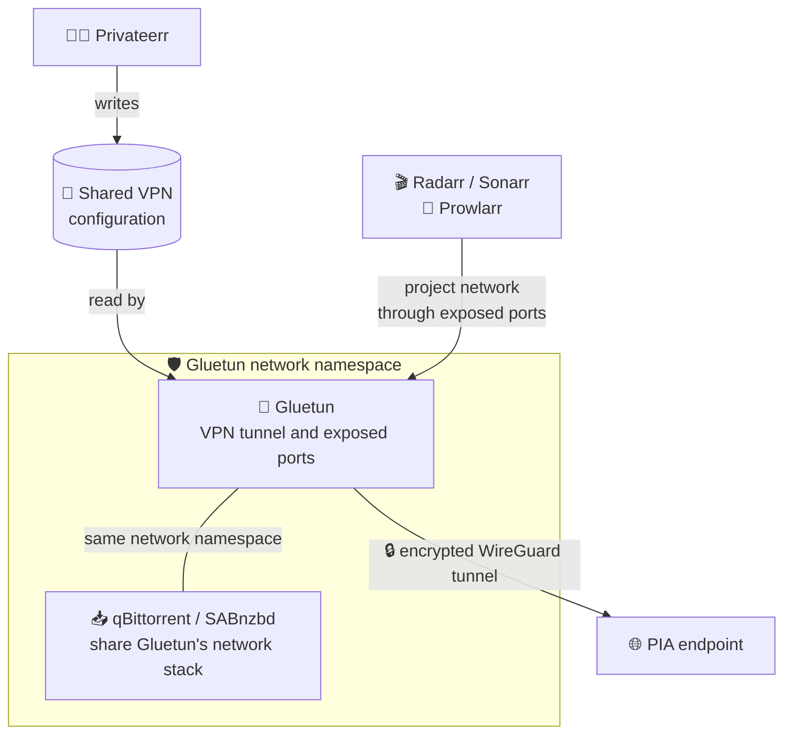

# How the fleet fits together

The easiest way to understand a media stack is to separate it into lanes. A
container may speak to several lanes, but each lane has one job.

| Lane       | Typical services                                            | Responsibility                                                                 |
| ---------- | ----------------------------------------------------------- | ------------------------------------------------------------------------------ |
| Requests   | Seerr                                                       | Turns human requests into manager activity.                                    |
| Discovery  | Prowlarr, FlareSolverr                                      | Supplies indexers and supported challenge handling.                            |
| Management | Radarr, Sonarr, Whisparr, Bazarr                            | Chooses releases and manages final library files.                              |
| Download   | qBittorrent, SABnzbd                                        | Retrieves payloads into a shared download root.                                |
| VPN        | Privateerr, Gluetun                                         | Generates VPN configuration, runs the tunnel, and handles PIA port forwarding. |
| Playback   | Plex, Jellyfin                                              | Scans and serves completed media libraries.                                    |
| Operations | Homepage, Duplicati, Cleanuparr, Speedtest Tracker, Apprise | Observability, backup, cleanup, and notification work.                         |
| Curation   | Kometa, ImageMaid, PATTRMM, Tautulli, Notifiarr             | Improves and monitors an existing Plex deployment.                             |

## The VPN boundary



Only selected download clients need to share Gluetun's network namespace.
Managers, indexers, dashboards, and playback servers normally stay on the
project network and reach the download clients through the ports exposed by
Gluetun.

!!! warning
    `network_mode: service:gluetun` means the download client does not own a
    separate network identity. Publish its Web UI and inbound ports on Gluetun,
    not on the download-client service.

## The storage boundary

Use consistent container paths across apps. If qBittorrent reports a completed
file as `/downloads/movies/example.mkv`, Radarr should see that same file at
`/downloads/movies/example.mkv`. Mapping the same host directory to different
container paths creates remote-path and hardlink problems.

```text
Host
├── downloads
│   ├── complete
│   └── incomplete
├── media
│   ├── movies
│   ├── tv
│   └── anime
└── docker
    └── plundarr
        └── config
```

## Responsibility map

- **Maraudarr** generates Plundarr; it is not a long-running media service.
- **Privateerr** generates PIA files; it does not carry traffic.
- **Gluetun** carries VPN traffic and coordinates port forwarding.
- **Download clients** retrieve files; they should not organize the library.
- **Radarr/Sonarr** import and organize; they should not be the download engine.
- **Plex/Jellyfin** serve completed libraries; they should not watch incomplete
  download directories.
